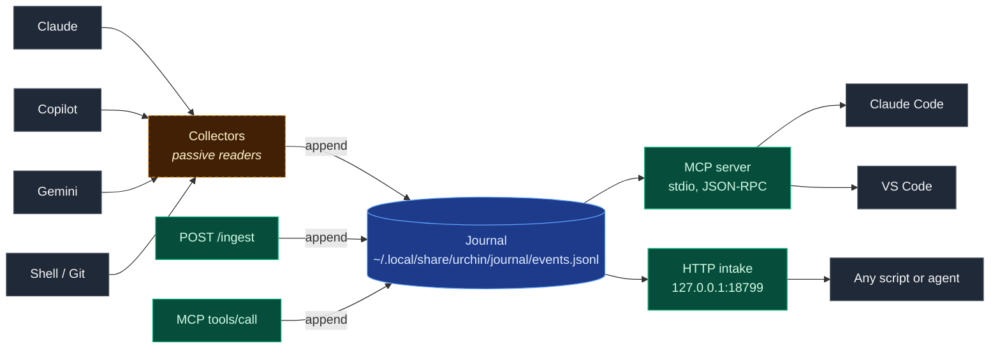

<div align="center">

# Urchin

**Urchin gives every AI tool the same memory.**


</div>

---

Claude, Copilot, Gemini, Codex, VS Code, the shell — each one has its own memory, none of them share. Urchin runs as a local daemon, collects activity from every tool into one append-only journal, and serves that journal back through MCP and HTTP so any tool can read what the others did.

> Urchin does not own your tools. It connects them.
> It is additive. Nobody loses anything. Every tool you already use gets better.

---

## How it flows



Solid boxes are live. Dashed boxes are Phase 4 (not built yet).

---

## Roadmap

| Spike | Status | Description |
|---|---|---|
| Core types + journal | ✅ shipped | `Event`, `Journal`, `Identity`, `Config` — append-only JSONL at `~/.local/share/urchin/journal/events.jsonl` |
| Identity envelope | ✅ shipped | Account/device resolved from `$USER` and `/etc/hostname`, attached to every event |
| TOML config + env overrides | ✅ shipped | Defaults → `~/.config/urchin/config.toml` → environment variables |
| CLI: `doctor` | ✅ shipped | Identity, config source, vault, intake port, journal stats |
| CLI: `ingest` | ✅ shipped | `--kind`, `--title`, `--tags`, `--workspace`, `--source` |
| HTTP intake | ✅ shipped | `POST /ingest`, `GET /health`, bound to `127.0.0.1` only |
| MCP server (stdio) | ✅ shipped | JSON-RPC 2.0 with 5 tools — status, ingest, recent_activity, project_context, search |
| Shell collector | 🔲 next | Tail `~/.bash_history` and append new entries |
| Git collector | 🔲 next | Walk known repo roots, ingest commits since last checkpoint |
| Claude collector | 🔲 planned | Read `~/.claude/history.jsonl` and project transcripts |
| Copilot collector | 🔲 planned | Read `~/.copilot/session-state/` |
| Gemini collector | 🔲 planned | Read `~/.gemini/tmp/*/chats/*.json` |
| Agent bridge | 🔲 planned | Generic JSONL intake queue at `URCHIN_AGENT_EVENTS_PATH` |
| Daemon mode | 🔲 planned | `urchin serve` runs intake plus a collector tick loop |
| Vault projection | 🔲 planned | Marker block writes inside `<!-- URCHIN:*:START/END -->`, `_urchin/` namespace only |
| Remote sync bridge | 🔲 planned | Pull/sync the journal across machines (WSL / VPS) |

**19 tests passing** across `urchin-core` (7), `urchin-intake` (2), and `urchin-mcp` (10).

---

## Quick start

```bash
git clone https://github.com/samhcharles/urchin-rust
cd urchin-rust
cargo build                                              # → target/debug/urchin
```

**Health check:**

```bash
cargo run -p urchin-cli -- doctor
```
```
urchin doctor
  identity:  account=<you>  device=<host>
  journal:   ~/.local/share/urchin/journal/events.jsonl
             426 events, 445 KB, last: 2026-04-24T22:27:18Z (test)
```

**Write an event from the CLI:**

```bash
cargo run -p urchin-cli -- ingest \
  --content "wired MCP to Claude Code" \
  --workspace "$(pwd)"
# ingested: <uuid>
```

**Run the HTTP daemon and hit it:**

```bash
cargo run -p urchin-cli -- serve &
curl -s localhost:18799/health
curl -s -X POST localhost:18799/ingest \
  -H 'Content-Type: application/json' \
  -d '{"content":"hello from curl","source":"script","workspace":"/tmp"}'
```

**Run the MCP server (stdio, JSON-RPC 2.0):**

```bash
echo '{"jsonrpc":"2.0","id":1,"method":"tools/list"}' \
  | cargo run -p urchin-cli -- mcp 2>/dev/null
```

To wire it to Claude Code, point your `~/.claude/settings.json` `mcpServers.urchin` entry at `target/debug/urchin` with arg `mcp`.

---

## Architecture

```
crates/
  urchin-core        types only: Event, Journal, Identity, Config  (zero I/O)
  urchin-intake      axum HTTP server: POST /ingest, GET /health
  urchin-mcp         MCP over stdio: 5 tools, JSON-RPC 2.0
  urchin-collectors  passive readers for claude/copilot/gemini/shell/git  [stubs]
  urchin-vault       Obsidian vault projection                            [stubs]
  urchin-cli         single binary: serve | mcp | doctor | ingest
```

### Event model

| Field | Type | Notes |
|---|---|---|
| `id` | UUID v4 | generated on create |
| `timestamp` | UTC datetime | ISO-8601 |
| `source` | string | `claude` / `copilot` / `cli` / `mcp` / ... |
| `kind` | enum | `Conversation` / `Agent` / `Command` / `Commit` / `File` / `Other` |
| `content` | string | the payload |
| `workspace` / `session` / `title` / `tags` | optional | context |
| `actor` | optional | `{ account, device, workspace }` — identity envelope |

The journal is append-only JSONL. Events are never mutated. Unknown fields are ignored on read, so events from the Node.js reference implementation deserialize cleanly alongside new ones.

---

## MCP tools

| Tool | Required args | Purpose |
|---|---|---|
| `urchin_status` | — | event count, last event, paths, identity |
| `urchin_ingest` | `content`, `workspace` | write an event to the journal |
| `urchin_recent_activity` | — | filter by `hours` / `source` / `limit` |
| `urchin_project_context` | `project` | match content, tags, or workspace path |
| `urchin_search` | `query` | case-insensitive substring over content |

Errors return `isError: true` on the content block. Queries return one line per event, newest first: `[timestamp] source — content (truncated to 120 chars)`.

---

## HTTP intake

Binds to `127.0.0.1:18799` only. Not a public endpoint.

```
GET  /health    → { "status": "ok", "events": <count>, "journal": <path> }
POST /ingest    → { "id": "<uuid>", "status": "ok" }
```

Request body for `/ingest`:

```json
{
  "content":   "required",
  "source":    "optional, defaults to http",
  "workspace": "optional",
  "kind":      "optional, defaults to conversation",
  "title":     "optional",
  "tags":      ["optional"],
  "session":   "optional"
}
```

---

## Commands

| Command | Purpose |
|---|---|
| `urchin doctor` | Show identity, config source, paths, journal stats |
| `urchin ingest` | Write a single event from the command line |
| `urchin serve` | Start the HTTP intake daemon on `127.0.0.1:<port>` |
| `urchin mcp` | Run the MCP server over stdio (JSON-RPC 2.0) |

Build once, run from `target/debug/urchin` or via `cargo run -p urchin-cli -- <command>`.

---

## Configuration

Config layers, last wins: defaults → `~/.config/urchin/config.toml` → environment variables.

```toml
# ~/.config/urchin/config.toml — every key optional
vault_root   = "/home/you/brain"
journal_path = "/home/you/.local/share/urchin/journal/events.jsonl"
cache_path   = "/home/you/.local/share/urchin/event-cache.jsonl"
intake_port  = 18799
remote_host  = "vps.example.com"
```

| Variable | Overrides | Default |
|---|---|---|
| `URCHIN_VAULT_ROOT` | `vault_root` | `~/brain` |
| `URCHIN_JOURNAL_PATH` | `journal_path` | `~/.local/share/urchin/journal/events.jsonl` |
| `URCHIN_INTAKE_PORT` | `intake_port` | `18799` |
| `URCHIN_ACCOUNT` | identity `account` | `$USER` |
| `URCHIN_DEVICE` | identity `device` | hostname |
| `URCHIN_LOG` | tracing filter | `urchin=info` |

---

## Rules

> [!IMPORTANT]
> 1. `urchin-core` has zero I/O — pure types and serialization only.
> 2. The journal is append-only. Events are written once, never mutated.
> 3. Vault writes happen only inside `<!-- URCHIN:*:START/END -->` marker blocks or under `_urchin/`. Human content outside markers is untouched.
> 4. Collectors read. They never write back to source tools.
> 5. MCP is stdio, not HTTP. That's how Claude Code and VS Code wire it.
> 6. One binary out: `cargo build` → `target/debug/urchin`.

---

<div align="center">
<sub>Local-first. Additive. Not a trap.</sub>
</div>
